# 📊 WIDGETS - Diagramas e Relacionamentos

## 🎨 Diagrama Hierárquico de Widgets

```mermaid
graph TD
    A["🎯 FILAMENT WIDGETS<br/>Total: 14"] --> B["🏢 ADMIN<br/>7 Widgets"]
    A --> C["👥 HR<br/>3 Widgets"]
    A --> D["👤 EMPLOYEE<br/>3 Widgets"]
    A --> E["🌍 GLOBAL<br/>2 Widgets"]
    
    B --> B1["📊 Departamentos<br/>2 widgets"]
    B --> B2["📋 Contratos<br/>3 widgets"]
    B --> B3["✅ Presença<br/>2 widgets"]
    
    B1 --> B1A["Stats: DepartmentStats"]
    B1 --> B1B["Chart: DepartmentChart"]
    
    B2 --> B2A["Stats: ContractOverview"]
    B2 --> B2B["Chart: ContractStatus"]
    B2 --> B2C["Chart: ContractType"]
    
    B3 --> B3A["Stats: AttendanceOverview"]
    B3 --> B3B["Chart: AttendanceChart"]
    
    C --> C1["👥 Funcionários"]
    C --> C2["⚠️ Alertas"]
    C --> C3["📅 Licenças"]
    
    C1 --> C1A["Stats: EmployeeDirectory"]
    C2 --> C2A["Stats: ContractExpiration"]
    C3 --> C3A["Stats: PendingTimeoffs"]
    
    D --> D1["📅 Licenças"]
    D --> D2["✅ Presença"]
    D --> D3["⏰ Banco Horas"]
    
    D1 --> D1A["Stats: MyTimeoffHistory"]
    D2 --> D2A["Stats: MyAttendance"]
    D3 --> D3A["Stats: HourBankDetail"]
    
    E --> E1["Stats: GeneralStats"]
    E --> E2["Custom: EmployeeInfo"]
    
    style A fill:#1e40af
    style B fill:#059669
    style C fill:#d97706
    style D fill:#7c3aed
    style E fill:#0891b2
    style B1A fill:#86efac
    style B2A fill:#fbbf24
    style B3A fill:#93c5fd
```

---

## 🔄 Diagrama de Fluxo de Dados

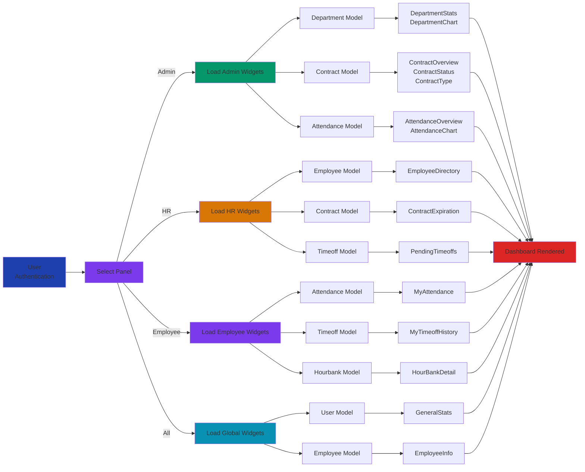

---

## 📊 Diagrama de Cobertura de Dados

```mermaid
graph TB
    A["Categorias de Dados"] --> A1["Departamentos ✅"]
    A --> A2["Contratos ✅"]
    A --> A3["Presença ✅"]
    A --> A4["Licenças ✅"]
    A --> A5["Banco Horas ✅"]
    A --> A6["Funcionários ✅"]
    A --> A7["Benefícios ❌"]
    A --> A8["Worklogs ❌"]
    
    A1 --> A1P1["DepartmentStats<br/>Admin"]
    A1 --> A1P2["DepartmentChart<br/>Admin"]
    
    A2 --> A2P1["ContractOverview<br/>Admin"]
    A2 --> A2P2["ContractStatus<br/>Admin"]
    A2 --> A2P3["ContractType<br/>Admin"]
    A2 --> A2P4["ContractExpiration<br/>HR"]
    A2 --> A2P5["GeneralStats<br/>Global"]
    
    A3 --> A3P1["AttendanceOverview<br/>Admin"]
    A3 --> A3P2["AttendanceChart<br/>Admin"]
    A3 --> A3P3["MyAttendance<br/>Employee"]
    A3 --> A3P5["GeneralStats<br/>Global"]
    
    A4 --> A4P1["PendingTimeoffs<br/>HR"]
    A4 --> A4P2["MyTimeoffHistory<br/>Employee"]
    A4 --> A4P5["GeneralStats<br/>Global"]
    
    A5 --> A5P1["HourBankDetail<br/>Employee"]
    
    A6 --> A6P1["EmployeeDirectory<br/>HR"]
    A6 --> A6P2["EmployeeInfo<br/>Global"]
    A6 --> A6P5["GeneralStats<br/>Global"]
    
    style A fill:#1e40af
    style A1 fill:#86efac
    style A2 fill:#fbbf24
    style A3 fill:#93c5fd
    style A4 fill:#d8b4fe
    style A5 fill:#67e8f9
    style A6 fill:#f0fdf4
    style A7 fill:#fecaca
    style A8 fill:#fecaca
```

---

## 🎨 Diagrama de Tipos de Widget

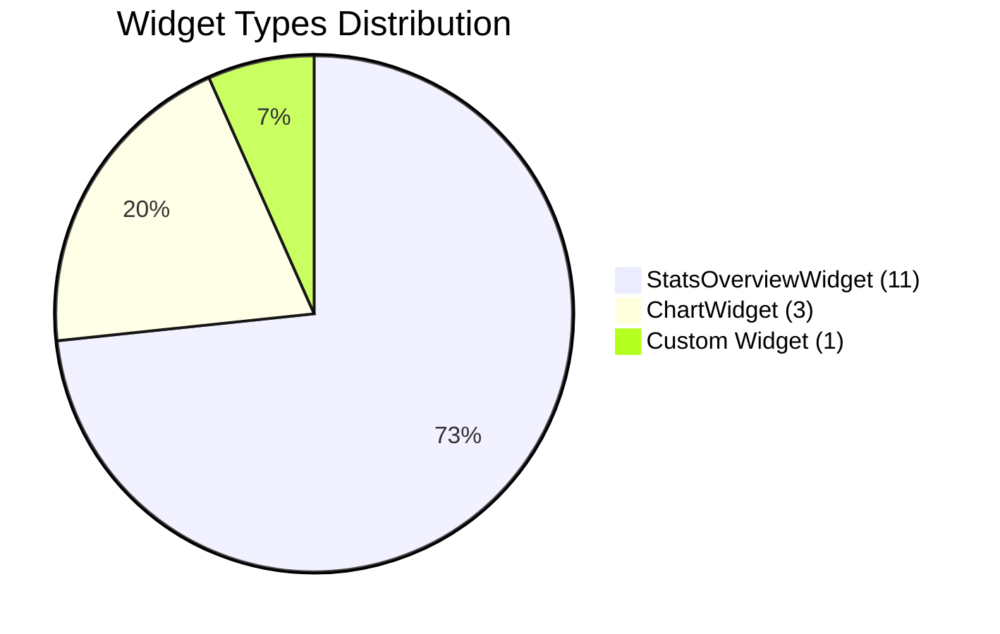

---

## 📊 Diagrama de Distribuição por Panel

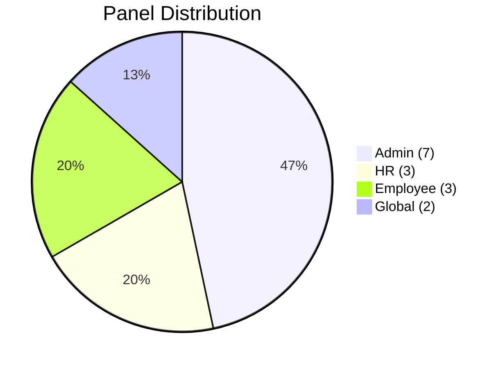

---

## 🔀 Diagrama de Categoria Distribution

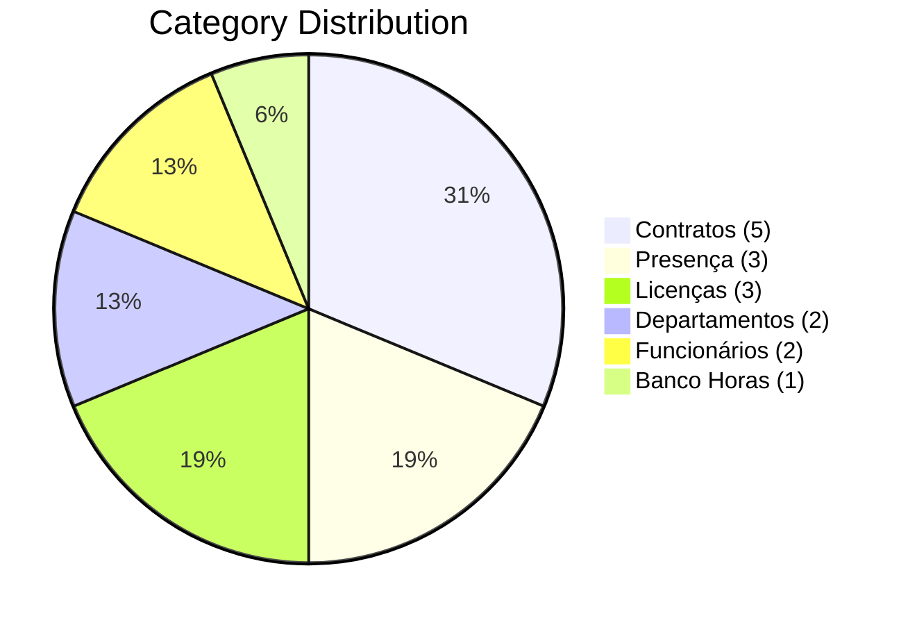

---

## 📈 Diagrama de Stats vs Charts

```mermaid
bar
    title "Stats vs Charts Distribution"
    x-axis "Type"
    y-axis "Quantity"
    "StatsOverviewWidget": 11
    "ChartWidget": 3
    "Custom": 1
```

---

## 🗺️ Diagrama de Models Usados

```mermaid
graph TB
    M1["User"] -.->|Auth| E["EmployeeInfoWidget"]
    M1 -->|Count| G["GeneralStats"]
    
    M2["Employee"] -->|withCount| D["DepartmentStats"]
    M2 -->|withCount| DC["DepartmentChart"]
    M2 -->|where| ED["EmployeeDirectory"]
    M2 -->|current user| MI["EmployeeInfoWidget"]
    M2 -->|current user| MA["MyAttendance"]
    M2 -->|current user| MT["MyTimeoff"]
    M2 -->|current user| HB["HourBankDetail"]
    M2 -->|Count| G
    
    M3["Department"] -->|withCount| D
    M3 -->|withCount| DC
    
    M4["Contract"] -->|where status| CO["ContractOverview"]
    M4 -->|groupBy| CS["ContractStatus"]
    M4 -->|groupBy| CT["ContractType"]
    M4 -->|where end_date| CEA["ContractExpiration"]
    M4 -->|where status| G
    
    M5["Attendance"] -->|whereDate| AO["AttendanceOverview"]
    M5 -->|daily| AC["AttendanceChart"]
    M5 -->|current user| MA
    
    M6["Timeoff"] -->|where status| PT["PendingTimeoffs"]
    M6 -->|current user| MT
    M6 -->|count| G
    
    M7["Hourbank"] -->|latest| HB
    
    style M1 fill:#1e40af
    style M2 fill:#059669
    style M3 fill:#d97706
    style M4 fill:#7c3aed
    style M5 fill:#0891b2
    style M6 fill:#dc2626
    style M7 fill:#7c2d12
```

---

## 🧩 Diagrama de Padrão de Design

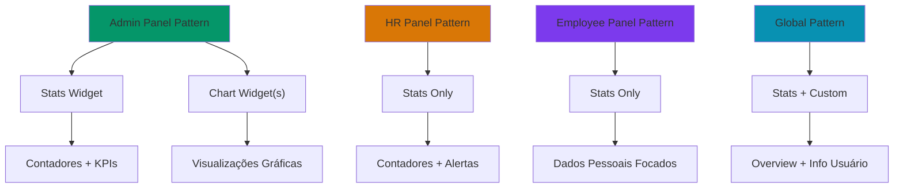

---

## 📋 Diagrama de Registro em PanelProviders

```mermaid
graph TB
    A["AdminPanelProvider"] --> A1["AccountWidget"]
    A --> A2["FilamentInfoWidget"]
    A --> A3["GeneralStats"]
    A --> A4["AttendanceOverviewWidget"]
    A --> A5["DepartmentStatsWidget"]
    A --> A6["ContractOverviewWidget"]
    A --> A7["ContractTypeDistributionWidget"]
    A --> A8["DepartmentChartWidget"]
    A --> A9["ContractStatusChartWidget"]
    A --> A10["AttendanceChartWidget"]
    
    B["HRPanelProvider"] --> B1["AccountWidget"]
    B --> B2["FilamentInfoWidget"]
    B --> B3["GeneralStats"]
    B --> B4["EmployeeDirectoryWidget"]
    B --> B5["ContractExpirationAlertWidget"]
    B --> B6["PendingTimeoffsWidget"]
    
    C["EmployeePanelProvider"] --> C1["AccountWidget"]
    C --> C2["FilamentInfoWidget"]
    C --> C3["GeneralStats"]
    C --> C4["MyAttendanceWidget"]
    C --> C5["MyTimeoffHistoryWidget"]
    C --> C6["HourBankDetailWidget"]
    
    style A fill:#059669
    style B fill:#d97706
    style C fill:#7c3aed
    style A3 fill:#0891b2
    style B3 fill:#0891b2
    style C3 fill:#0891b2
```

---

## 🔄 Ciclo de Vida de Um Widget

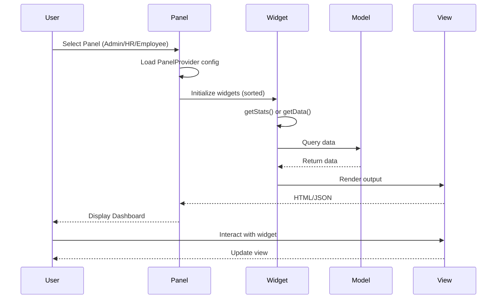

---

## 🎯 Matriz de Relacionamento Admin-HR-Employee

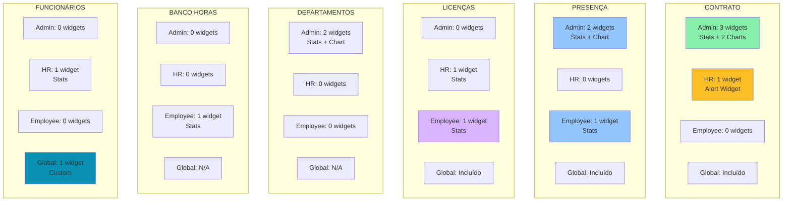

---

## 📊 Diagrama de Sort Order (Admin)

```
┌─────────────────────────────────────────────────────┐
│                 ADMIN DASHBOARD                      │
├─────────────────────────────────────────────────────┤
│                                                     │
│ Position 1 ┌─────────────────────────────────────┐ │
│            │ GeneralStats (Global) OR            │ │
│            │ AttendanceOverviewWidget (Admin)    │ │
│            └─────────────────────────────────────┘ │
│                  (Ambos têm sort=1)                │
│                                                     │
│ Position 2 ┌─────────────────────────────────────┐ │
│            │ DepartmentStatsWidget               │ │
│            └─────────────────────────────────────┘ │
│                                                     │
│ Position 3 ┌─────────────────────────────────────┐ │
│            │ ContractOverviewWidget              │ │
│            └─────────────────────────────────────┘ │
│                                                     │
│ Position 4 ┌─────────────────────────────────────┐ │
│            │ ContractTypeDistributionWidget      │ │
│            └─────────────────────────────────────┘ │
│                                                     │
│ Position 5 ┌─────────────────────────────────────┐ │
│            │ DepartmentChartWidget               │ │
│            └─────────────────────────────────────┘ │
│                                                     │
│ Position 6 ┌─────────────────────────────────────┐ │
│            │ ContractStatusChartWidget           │ │
│            └─────────────────────────────────────┘ │
│                                                     │
│ Position 7 ┌─────────────────────────────────────┐ │
│            │ AttendanceChartWidget               │ │
│            └─────────────────────────────────────┘ │
│                                                     │
└─────────────────────────────────────────────────────┘
```

---

## 🚀 Roadmap Proposto

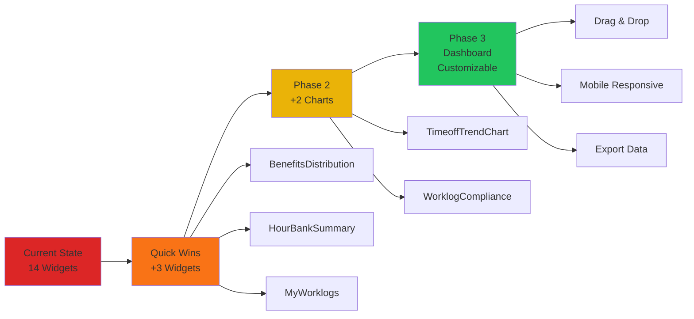

---

## 🎯 Resumo Visual

| Aspecto | Visual | Quantidade |
|---------|--------|-----------|
| **Total** | ████████████████████░░░░░░ | 14 |
| **Admin** | ███████░░░░░░░░░░░░░░░░░░░ | 7 |
| **HR** | ███░░░░░░░░░░░░░░░░░░░░░░░ | 3 |
| **Employee** | ███░░░░░░░░░░░░░░░░░░░░░░░ | 3 |
| **Global** | ██░░░░░░░░░░░░░░░░░░░░░░░░ | 2 |

---

**Diagramas Criados:** 2026-02-10  
**Visualizações:** 11 diagramas Mermaid  
**Status:** ✅ Análise Visual Completa
